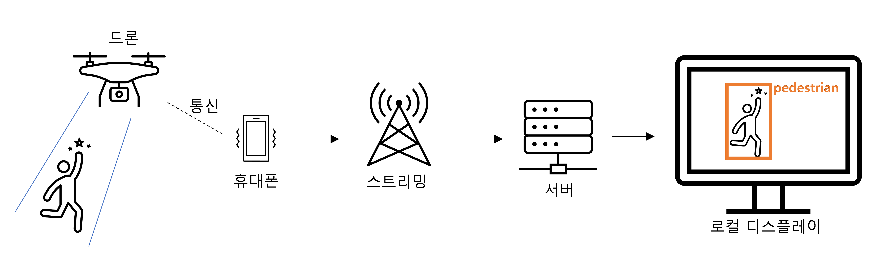

# Real-time Object Detection with Drone
## 스트리밍 서비스를 활용한 드론의 객체 탐지

드론이 스트리밍 서비스만 제공한다면, 드론 내부의 하드웨어 변경이나, 소프트웨어(드론 어플리케이션)의 변경 없이도 실시간 객체 탐지가 가능합니다.

- 구조
    
    드론에서 촬영되는 영상을 스트리밍 서비스로 전송 -> 스트리밍 URL을 모델에 입력하여 출력되는 영상에 대해 실시간으로 객체 탐지 -> Bounding Box가 씌워진 영상을 실시간으로 로컬 디스플레이로 출력 가능

### 적용 영상
- 영상이 빨리 지나가거나 끊길 수록 FPS가 낮습니다.
업로드 된 유튜브 영상을 사용한 경우:
  - YOLOv5n(GPU)

      
  - YOLOv5s(GPU)

      
  - YOLOv5m(GPU)

      

실시간 스트리밍 영상을 사용할 경우:
 - YOLOv5n(CPU)
    
    
 - YOLOv5m(GPU)

    
